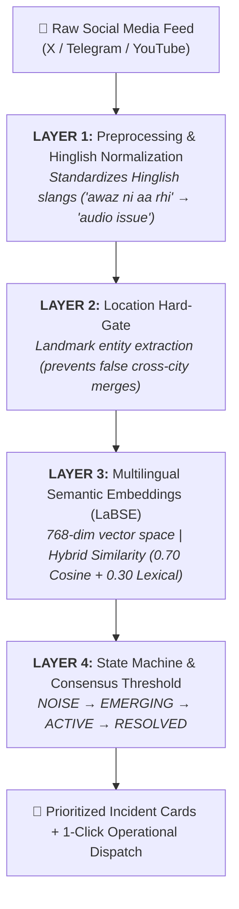

# PULSE
### Sovereign Social Media Analytics & Emergency Incident Triage Engine

[](https://sih.gov.in)
[](https://sih.gov.in)
[](https://sih.gov.in)
[](https://sih.gov.in)
[](#data-privacy--sovereignty)

**PULSE** is a real-time social media intelligence and incident triage platform built for emergency response teams and national security agencies. It ingests chaotic citizen chatter across multiple platforms, deduplicates multi-lingual reports using local vector embeddings, and enables officials to verify and bulk-resolve incidents in under 5 seconds.

---

## The Problem

Public safety agencies (such as State Police command rooms and emergency response grids) receive tens of thousands of citizen reports daily across public social media platforms.

- **High Noise Ratio:** Over 80% of inbound traffic consists of repetitive duplicates, bot spam, and irrelevant chatter.
- **Triage Bottleneck:** During high-priority emergencies (expressway collisions, industrial hazards, urban flooding), manual scrolling through unorganized replies takes 2 to 4 hours.
- **Language Diversity:** Citizen reports arrive in an informal mix of English, Hindi, and regional Hinglish slang ("gaadi palat gayi", "accident near flyover"), breaking standard keyword-matching filters.

---

## The Solution

PULSE solves this bottleneck by providing an end-to-end sovereign triage pipeline:

1. **Deduplication** — Aggregates hundreds of differently worded messages into a single, evolving Incident Alert Card.
2. **Dual-Window Triage** — Displays raw incoming citizen reports on the left while dynamically updating verified incident signals on the right.
3. **1-Click Resolution** — Allows responding officers to dispatch an official response that updates and resolves all contributing citizen reports in one click.
4. **On-Premise Privacy** — Runs entirely on local server hardware, ensuring citizen crime data is never leaked to external third-party cloud APIs.

---

## Core Platform Pillars
┌──────────────────────────────────────────────┐
│ PULSE MASTER GATEWAY │
│ (/dashboard) │
└──────────────────────┬───────────────────────┘
│
┌─────────────────┼─────────────────┬─────────────────┐
│ │ │ │
▼ ▼ ▼ ▼
┌────────────┐ ┌────────────┐ ┌────────────┐ ┌────────────┐
│ X (Twitter)│ │ Telegram │ │ YouTube │ │ Classified │
│ Command │ │Intelligence│ │ Station │ │ OSINT │
│ Station │ │ Hub │ │ (OAuth) │ │ Terminal │
└────────────┘ └────────────┘ └────────────┘ └────────────┘


### 1. X (Twitter) Command Station
- **Production OAuth 2.0 PKCE:** Secure authentication via Twitter API v2 with persistent token storage in PostgreSQL.
- **Official Post Autopsy:** Inspects public reactions to official advisories, rendering a Multi-Dimensional Sentiment Spectrum (Anxiety/Panic, Supportive, Frustration, Civic Inquiries, and Sarcasm).
- **Dual-Window Split Triage:**
  - *Left Stream:* Chronological inflow of citizen reports and evidence photos.
  - *Right Stream:* AI-fused Incident Cards displaying landmark validation, confidence ratings, and credibility scores.
- **1-Click Bulk Action `[ ADDRESS INCIDENT ]`:** Dispatches official threaded replies, instantly marking all contributing citizen tweets as `✓ Addressed by Agency`.
- **Live Ingestion Console:** Integrated composer allowing operators to inject text and evidence photos with a built-in 2-reply consensus threshold for emerging incidents.

### 2. Telegram Intelligence Hub
- **Native Telethon MTProto Client:** Direct binary protocol integration supporting international phone authentication, OTP validation, and 2-Step Verification (2FA).
- **HTTP 206 Partial Chunk Streaming:** Smooth in-browser streaming of high-resolution video evidence and PDF reports without memory constraints.
- **Forward Network Tracking:** Analyzes forward velocity, aggregate reach, and public broadcast network propagation.

### 3. YouTube Intelligence Station
- **Google OAuth Integration:** Live chat polling with a 30-second rolling momentum window.
- **Signal Compression:** Fuses hundreds of noisy comments into core discussion themes using local clustering.
- **Pulse Health Gauge (0–100):** Real-time measurement of overall audience sentiment, clarity, and engagement stability.

### 4. Classified OSINT Terminal
- **Air-Gapped Investigation Terminal:** Passcode-secured for covert inspection of public links across YouTube, X, Telegram, and Instagram.
- **Live Tactical Asset Viewer:** In-terminal interactive asset player and post inspector.
- **Zero Exfiltration Policy:** Follows an EYES-ONLY protocol where data exports are strictly restricted to prevent unauthorized intelligence leaks.

---

## Under-The-Hood AI Architecture

PULSE uses an efficient, local 4-layer Natural Language Processing pipeline:



## NTRO Problem Statement (SIH26152) Alignment

| Mandate Component                        | PULSE Implementation                                                                 |
|------------------------------------------|--------------------------------------------------------------------------------------|
| A. Continuous Ingestion & Timeline       | Live data ingestion from X (OAuth 2.0 PKCE), Telegram (Telethon MTProto), and YouTube with chronological area heatmaps |
| B. Multi-Dimensional Sentiment           | Multi-vector emotional tracking (Anxiety, Panic, Frustration, Civic Questions, Sarcasm) mapped over time bins |
| C. Demographic Profiling                 | Audience DNA Panel classifying participants into Champions, Inquirers, Active Citizens, and Noise/Bots |
| D. Real-Time Trend & Topic Detection     | 30-second rolling momentum calculation (`+14 replies/min`) with high-density signal compression |
| E. Link Analysis & Network Topology      | Key Opinion Leader (KOL) node mapping, Telegram forward cascade tracking, and bot swarm suppression |

---

## Data Privacy & Sovereignty (DPDP Act 2023)

- **Local On-Premise Execution:** Core deduplication models run locally on CPU/GPU hardware with a ~50ms inference budget.
- **Zero Foreign Cloud Exposure:** Sensitive citizen reports, coordinates, and emergency dispatches are never routed through foreign commercial LLM APIs.
- **Audit Trail Generation:** Every incident resolution creates an immutable, timestamped case autopsy record for institutional accountability.

---

## Project Structure

```text
pulse/
├── backend/                  # FastAPI Application
│   ├── app/
│   │   ├── api/              # API Routers: Twitter, Telegram, YouTube, OSINT
│   │   ├── db/               # SQLAlchemy engine, session & Supabase setup
│   │   ├── models/           # Relational database models
│   │   ├── pulse_engine/     # Core NLP: LaBSE embedder, fusion, classification
│   │   ├── services/         # Platform services: audience DNA, timeline, reports
│   │   └── main.py           # FastAPI application entry point
│   ├── datasets/             # Benchmark incident scenarios & demo data
│   └── requirements.txt      # Python dependencies
├── frontend/                 # Next.js 16 App Router Frontend
│   ├── app/                  # Pages: dashboard, twitter, telegram, classified
│   ├── components/           # UI Components: analytics, triage consoles, cards
│   ├── lib/                  # API client, constants, and utilities
│   ├── store/                # Zustand state stores: auth, theme
│   └── package.json          # Node.js dependencies
└── README.md
```

## Tech Stack

| Layer          | Technologies                                      |
|----------------|---------------------------------------------------|
| Backend        | Python, FastAPI, SQLAlchemy, Telethon             |
| Frontend       | Next.js 16, React, TypeScript, Zustand            |
| Database       | PostgreSQL (Supabase)                             |
| AI / NLP       | LaBSE (local embeddings), custom fusion pipeline  |
| Auth           | Twitter OAuth 2.0 PKCE, Google OAuth, Telethon 2FA|
| Infra          | Docker-ready, on-premise / local-first            |

---

## Quick Start (Local Setup)

### Prerequisites
- Python 3.10+
- Node.js 18+ and npm
- Git

### 1. Clone the Repository
```bash
git clone https://github.com/ssparsh183-lab/pulse.git
cd pulse
2. Backend Setup
Bash

cd backend
python -m venv venv

# Windows
venv\Scripts\activate

# macOS / Linux
source venv/bin/activate

pip install -r requirements.txt
uvicorn app.main:app --port 8000 --reload
3. Frontend Setup
Bash

cd ../frontend
npm install
npm run dev
Open http://localhost:3000 in your browser to access the local instance.


